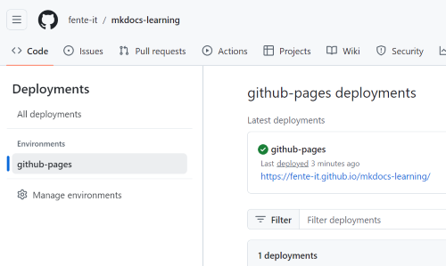

# Use markdown and Mkdocs for documentation

MkDocs is a powerful tool that generates static HTML sites from Markdown files. If you want developers to document their work effectively, it's important to keep the documentation close to the code. Markdown is a natural fit for this purpose, as it integrates seamlessly with code repositories. To learn more, visit [mkdocs.org](https://www.mkdocs.org)


## Prerequisite

You need phyton installed. You can install Python using:

- Chocolatey (on Windows)
- Homebrew (on macOS)
- APT (on Linux)
- Python's official installer (from Welcome to Python.org )

Note! This guide works on Windows. Se repository generated [here](https://github.com/fente-it/mkdocs-learning)

## Steps
### 1 Install Mkdocs
Use pythons package manager pip to install mkdocs

```
$ pip install mkdocs
```
You are now ready to create the document.


### 2 Create site
MkDocs should now be in your path. If not you can find in the python installation C:\ProgramData\chocolatey\lib\python3\tools\Scripts.

Create documentation by Run
```
$ mkdocs new <name of documentation>
```
??? Sample
    

Host the documentation by running. 
```
$ mkdocs serve
```
The serve will build (meaning generate the html and js files) and run a local host for you. You can see the files in the site folder generated.

### 3 Change the style
To change the style add a custom css file and change the mkdocs.yml file


### 4 Deploy the site
Before you deploy you need to build the site so that it can generate html and javascript sites

```
$ mkdocs build
```
??? note "The files will be generated in a site folder as shown below. This is the folder to deploy"
    

#### 4.1 Deploy to Github
The simplest way is to deploy to a GitHub site. You need to have an existing git repository. Create a repository in GitHub and follow the guideline on how to 

_**Note**: the md files in a repository like github or Azure Devops to not the changes and keep track of history_

```
$ mkdocs gh-deploy
```
The deploy will generate a new branch called gh-pages and deploy to a github site. 


???+ "Sample in [mkdocs-learning](https://github.com/fente-it/mkdocs-learning)"
    

    


#### 4.2 Deploy to Azure Static Web App 

Howto deploy files to Azure static web App is explained [here](deploy-static-html-to-azure-static-app.md)
