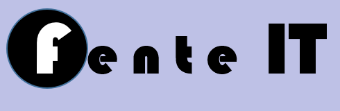

# Welcome to Fente ITs knowledge sharing site

Welcome to my learning documentation site! Here, I capture and share my learning journey for several reasons:

- **To help others**: By sharing what I learn, I hope to make it easier for others to benefit from my experience.
- **To reinforce my understanding**: Writing down what I've learned helps me retain the information more effectively.
- **To spark new ideas**: The process of documenting often leads to new insights and raises fresh questions.
- **To validate my knowledge**: Documenting forces me to check if I truly grasp the concepts I’m working with.
- **To improve efficiency**: I can quickly reference past solutions and workflows, saving time when facing similar challenges in the future.

