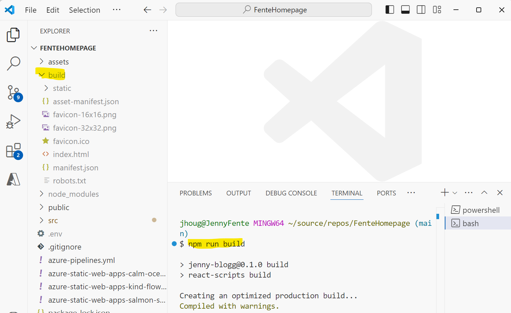

# Deploy static html site to Azure static web app

## Description
This tutorial is a step-by-step guide for deploy static web application where advanced build and deploy pipeline is not needed. It describes the steps of deploying your static files to an [Azure Static Web App](https://learn.microsoft.com/en-us/azure/static-web-apps/overview). The build and deploy pipeline can be added when needed, typically several developers working on same repository doing rapid changes (this is agility). 

### Prerequisites

- Azure CLI: 
    - Installing the Azure CLI: [Download the installer from the Azure CLI Installation page for Windows](https://learn.microsoft.com/en-us/cli/azure/install-azure-cli).
- [VS Code](https://code.visualstudio.com/)
- Node

### Guidelines from Microsoft
- [Learn Azure Static Web Apps](https://learn.microsoft.com/en-us/training/paths/azure-static-web-apps/)

## Steps

### 1 Install SWA (Static Web Application) CLI
In VS Code open the terminal and change the folder to the web application. Install CLI for the static web app using node. 

_**Note** For local installation the parameter -g can be skipped_


```
 npm install -g @azure/static-web-apps-cli
```
### 2 Build artifacts
If the application is an React, Vue or Anglar application it should be prepared for deployment. Meaning transforming code into browser-compatible JavaScript, optimizing minimizing files etc.

_For example a React application will generate the site in the build folder when running npm run build_  


### 3 Create the Azure Static Web App
You can create the Azure Static Web App using Azure Portal or [form VS Code](https://learn.microsoft.com/en-us/training/modules/publish-app-service-static-web-app-api/4-exercise-static-web-apps?ns-enrollment-type=learningpath&ns-enrollment-id=learn.azure-static-web-apps&pivots=angular) 

### 4 Deploy to Azure using SWA CLI

#### Login to your azure subscription

```
/** Using az CLI **/
az login

/** or Using swa ClI **/
 swa login
```
#### Deploy to the Azure static web app

```
swa deploy <folder to deploy> --app-name <name of the static web app> --resource-group <the static web app resource group> --env <environment>
```

[Overview of command arguments swa deploy | Static Web Apps CLI](https://azure.github.io/static-web-apps-cli/docs/cli/swa-deploy/) 


_Sample_

```
swa deploy ./build --app-name fente-homepage --resource-group fente-homepage-rg --env production
```
