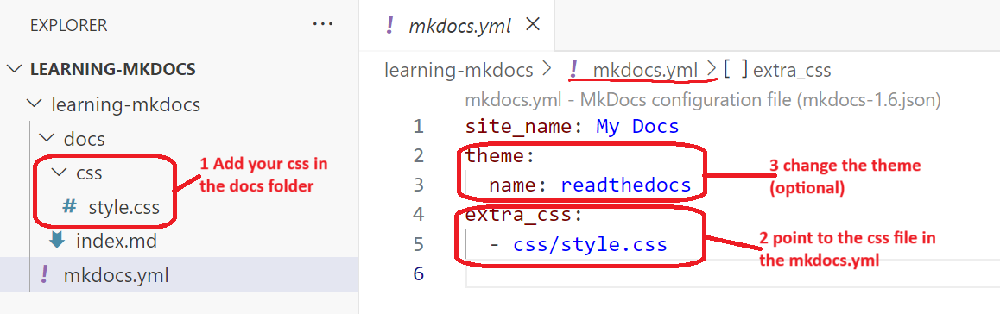
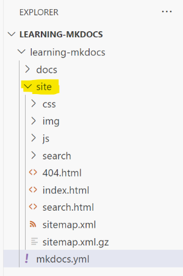

# Use markdown and Mkdocs for documentation

MkDocs is a powerful tool that generates static HTML sites from Markdown files. If you want developers to document their work effectively, it's important to keep the documentation close to the code. Markdown is a natural fit for this purpose, as it integrates seamlessly with code repositories. To learn more, visit [mkdocs.org](https://www.mkdocs.org)


## Prerequisite

[Phyton](https://www.python.org/) is required. Python can be installed using:

- Chocolatey (on Windows)
- Homebrew (on macOS)
- APT (on Linux)
- Python's official installer (from Welcome to Python.org )

Note! This guide works on Windows. Both Powershell and Gitbash can be used as commandline tool. 


## Steps

The repository of the sample application refered to in the tutorial can be found [here](https://github.com/fente-it/mkdocs-learning). 

### 1 Install Mkdocs
Open the commandline tool (Powershell or GitBash) and use Pythons package manager, pip, to install mkdocs.

``` 
$ pip install mkdocs
```


### 2 Create site
MkDocs should now be in the windows path. If not, it can be found in the python installation For example in the folder _C:\Python312\Scripts_

Create documentation site:
```
$ mkdocs new <name of documentation>
```
??? Sample
    

Host the documentation locally: 
```
$ mkdocs serve
```
The serve will build (meaning generate the html and js files) and run a local host.

### 3 Change the style (optional)
Add a custom css file and change the mkdocs.yml file



### 4 Build the site
Before you deploy you need to build the site so that it can generate html and javascript sites.

```
$ mkdocs build
```
The html and javascript files will be generated in a _site_ folder as shown below. It is the _site_ folder that should be deployd to the preferred host.
???+ Site 
    

### 5 Deploy the site
There are several ways to host the site. Below describes how to deploy to a GitHub Page and Azure Static Web App. Note that this is done manually using command line interface (CLI). The next step is to integrate this in a CI/CD pipeline. 

_**Note**: The markdown files should be kept in a versioncontrol repository like GitHub or Azure DevOps to keep track of history_. 

#### 4.1 Deploy to a GitHub Page
The simplest way is to deploy to a [GitHub Page](https://pages.github.com/). You need to have an existing git repository. Create a repository in GitHub and follow the guideling on GitHub to initialize the local repository with the GitHub repository. 


```
$ mkdocs gh-deploy
```
The deploy will generate a new branch called _gh-pages_ and deploy to a GitHub site. 


???+ "Sample in [mkdocs-learning](https://github.com/fente-it/mkdocs-learning)"
    

    


#### 4.2 Deploy to Azure Static Web App 

Howto deploy files to [Azure Static Web App](https://learn.microsoft.com/en-us/azure/static-web-apps/overview) is explained [here](deploy-static-html-to-azure-static-app.md)
